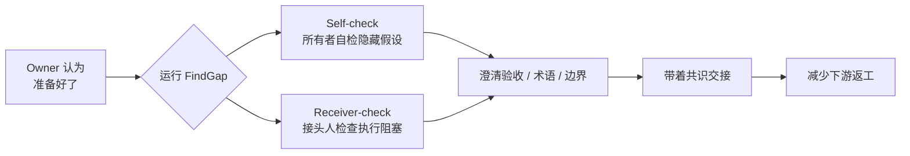

# FindGap

> **交接前最后一道认知校对。**  
> Catch the expensive gaps before handoff — not after.

当产出物所有者认为内容已经没有明显问题、准备交给下一个人或 agent 时，FindGap 帮你识别那些**仍未被看见、但会在下游引发高成本返工**的关键 gap。

<p align="center">
  <a href="LICENSE">MIT</a> · <a href="dogfood/baseline.md">Baseline</a> · <a href="CONTRIBUTING.md">Contribute</a> · <a href="ROADMAP.md">Roadmap</a>
</p>

---

## 它是什么 · What it is

FindGap 是一个**交接点 Gap 校对器**。

它不是每轮对话前的提示词检查器，也不替你改写文档。它只在一个时刻介入：**你觉得产物已经差不多了，准备交出去的那一刻**。这时最容易带着隐藏缺口进入下游，FindGap 就是拦这个时刻的。

FindGap is a **handoff-time gap checker**. It intervenes at the moment when the current owner already believes the artifact is good enough and is about to hand it off. It is not a per-turn prompt checker, not a writing improver, and not a PASS/FAIL scorer.

---

## 适合谁 · Who it is for

| 角色 | 使用场景 |
|------|---------|
| **产品 / 方案 Owner** | 把 PRD、需求、任务包交给工程前 |
| **工程 / 架构师** | 把技术方案、接口契约、实施计划交给下一个 builder 前 |
| **Agent 工作流用户** | 把产出物交给下一个 agent 前 |

---

## 为什么重要 · Why it matters

大多数高成本返工，**不是因为写得差**，而是因为隐含假设在交接时没有暴露：

- 验收标准从未锁定
- 失败路径从未显式化
- 关键术语在不同角色之间含义不同
- 约束和依赖被默认，没有被声明

等下游发现时，修的已经不是措辞，而是**白做的执行**。

---

## 可信的证据 · Evidence you can trust

FindGap 基于真实 dogfood 验证，不是泛泛建议。

| 指标 | 数据 |
|------|------|
| 真实样本 | 20 轮 handoff 场景提示词 |
| 整体精度 | **precision = 0.9805** |
| 高频 gap 类型 | 完成/验收、边界/失败路径、术语/定义、方法/约束/依赖 |

通俗地说：FindGap 标记出的 gap，绝大多数是真实的返工风险，而不是噪音。

详细数据见 [`dogfood/baseline.md`](dogfood/baseline.md)。

---

## 交接流程一览 · Handoff workflow

<!-- GitHub.com 原生渲染 Mermaid，其他客户端可能显示为代码 -->



**FindGap 不在每轮交互中打断你。它只在交接点介入——正是隐藏缺口最容易被忽略、代价最高的时刻。**

---

## 双模式 · Two modes

### Self-check（所有者自检）

交接前 owner 做最后一次自检。帮你识别：
- 哪些默认前提只存在于自己脑中
- 哪些地方自己以为说清了，但下游未必这么理解
- 哪些 gap 已经超出自己当前认知范围

### Receiver-check（接头人他检）

接手前 receiver 做他检。帮你识别：
- 如果现在开工，会卡在哪些信息缺口上
- 哪些地方会迫使自己默认补脑
- 哪些 gap 会在执行、联调、验收中放大成返工

---

## 看看效果 · See it in action

**输入产物：**

```text
支持 BNPL 结账能力。
范围：先做印尼。
上线尽快。
```

**FindGap 识别的交接缺口：**

```text
FindGap · 所有者自检 · 发现 2 处 gap 可能导致返工
> If I hand this off now, what will the next person misunderstand?

---

🔴 completion-acceptance-gap
原文："支持 BNPL 结账能力。"
缺口：缺少可观察的完成定义或验收标准。
下游风险：下游会在不同完成标准下继续推进，导致返工。

---

🟠 terminology-definition-gap
原文："支持 BNPL 结账能力。"
缺口：关键术语未定义，存在同名异义风险。
下游风险：下游可能按不同理解推进，导致接口或流程返工。
```

**重点不是生成更多文字，而是在下一个人带着错误理解开始做之前，把隐藏缺口拦下来。**

---

## 快速开始 · Quickstart

在你的 agent 环境中加载 FindGap，然后在交接时刻运行：

```text
/findgap 这是准备交给下一个 agent 的支付接入方案，先帮我做 self-check
/fg 我准备把这份 PRD 交给实现同学，做一下 receiver-check
/照 在 handoff 前看看这段技术方案还有哪些高成本 gap
```

也可以手动复制 `skill/FindGap.skill.md` 到你的 skills 目录。

**适合用的场景：**
- 把方案交给另一个工程师之前
- 把任务交给另一个 agent 之前
- 请别人帮你实施、评审或验收一份产物之前

**不适合的场景：**
- 闲聊
- 不涉及交接的普通编码
- 检查 AI 已交付的输出（那是 FindMiss 的事）

---

## 工作原理 · How it works

1. **扫描**：用内部 11 条规则集扫描产出物，找出可能的交接缺口
2. **校验依据**：有公开参考数据时用数据，没有时用上下文推理，信息不足时显式标注
3. **展示缺口**：固定结构展示原文锚点、缺失信息、下游风险、依据类型和补齐方向

核心原则：
- 三步流程，不多一步
- 不编造 URL 和证据
- 不维护运行时静态知识库
- 给方向，不替你做决策

---

## 文档 · Docs

README 是门面，不是手册。深度内容请看：

| 文档 | 内容 |
|------|------|
| [`docs/user-manual.md`](docs/user-manual.md) | 软件说明书 |
| [`docs/architecture.md`](docs/architecture.md) | 系统架构与模块管线 |
| [`docs/originality.md`](docs/originality.md) | 原创性与依赖声明 |
| [`dogfood/baseline.md`](dogfood/baseline.md) | 基线证据（20 轮验证） |
| [`ROADMAP.md`](ROADMAP.md) | 版本历史与方向 |

---

## 贡献 · Contribute

发现了真实的 gap，或者 FindGap 漏掉了？欢迎参与改进：

- 行为契约：`skill/FindGap.skill.md`
- 验证清单：`tests/verify-skill.md`
- Dogfood 证据：`dogfood/`
- 贡献指南：[`CONTRIBUTING.md`](CONTRIBUTING.md)

---

MIT · [GitHub](https://github.com/trustchain-ai/FindGap) · v1.0.0
