# 彻底爆了，微软也连发了2篇自进化Skill
> 公众号: PaperToday
> 发布时间: 2026年5月29日 00:35
> 原文链接: https://mp.weixin.qq.com/s/3IxI67-xTMTaOJo_fgVVKg

---

不改一行模型代码、不微调任何权重，只是把系**Skill**换成一张训练出来的新版本，Agent 的表现就从 **41.8** 飙到 **80.7**。

这不是思想实验，这是**微软**刚刚发表的**两篇论文**的真实结果。

[清华连发2篇自进化Skill，Agent彻底活了](https://mp.weixin.qq.com/s?__biz=Mzk0MTYzMzMxMA==&mid=2247507787&idx=1&sn=ba4c504a7a5d563a3957e76b5cc35a74&scene=21#wechat_redirect)

[美团连发2篇Skill，Agent彻底起飞](https://mp.weixin.qq.com/s?__biz=Mzk2NDQ2ODY2Mg==&mid=2247485909&idx=1&sn=2dce7c919d26fd05dd9a79cad3a82e5e&scene=21#wechat_redirect)

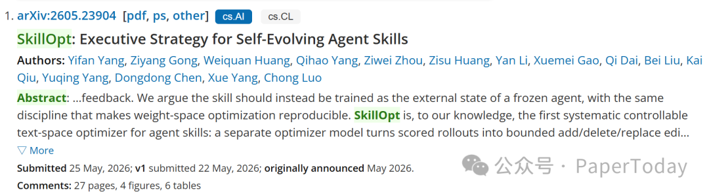

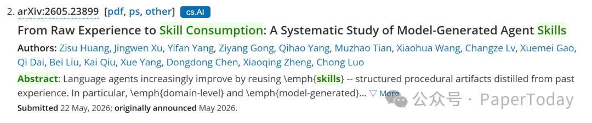

一篇叫 **SkillOpt**，讲的是怎么把 Agent Skill 当成模型一样来训练；另一篇是一个系统性的**Skill生命周期**研究，用 5 个领域、6 个模型回答了一个更根本的问题：模型自动生成的 Skill，到底什么时候有用，什么时候反而帮倒忙？

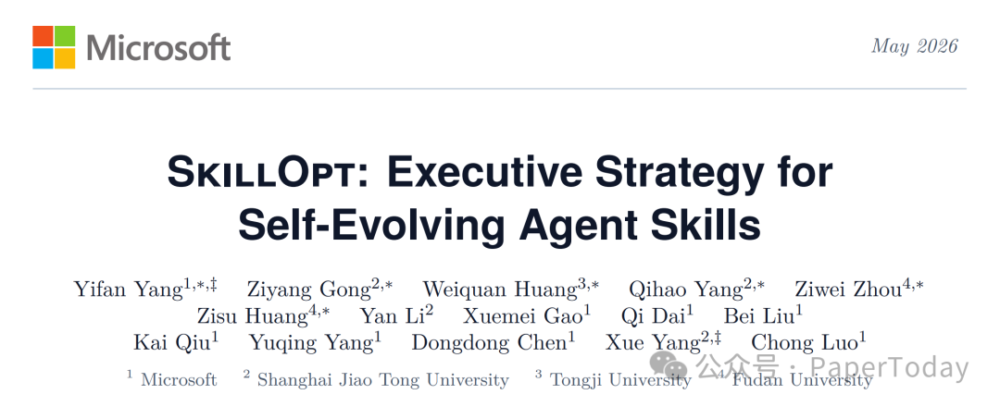

核心问题：**Skill 能不能像模型一样自动训练出来？**

微软的答案是：能，但不是随便写写就行。你需要引入一整套训练控制。

## SkillOpt：把深度学习的方法论搬到了 Skill 优化上

**SkillOpt** 的核心思路是把 Skill 文档当成"外部可训练状态"，用一个更强的模型（优化器）来编辑这个文档，整个过程像极了深度学习的训练循环：

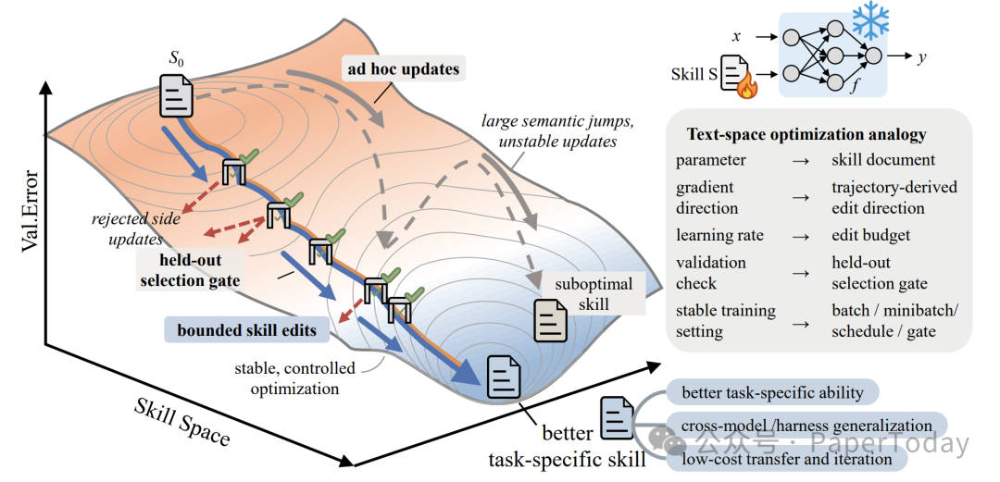

SkillOpt的架构

-   **Rollout batch = 训练数据**：目标模型用当前 Skill 跑一批任务，产出成功和失败的轨迹

-   **小批量反思 = 反向传播**：优化器把轨迹分成成功组和失败组，分别提炼出"什么该保留""什么要修正"

-   **文本学习率 = 步长控制**：每次最多改 `L` 条规则，防止一次改太多把有用的东西改没了

-   **验证门 = Early Stopping**：改完的 Skill 必须在验证集上严格提升才被接受，否则拒绝

-   **拒绝缓冲区 = 负样本记忆**：被拒绝的编辑不会丢掉，而是作为"什么不能改"的负反馈留给后面的优化步骤

-   **Epoch 级慢更新 = 动量**：每个 epoch 结束后，比较前后两版 Skill 在同一批任务上的表现，把长期有效的经验写进受保护区域

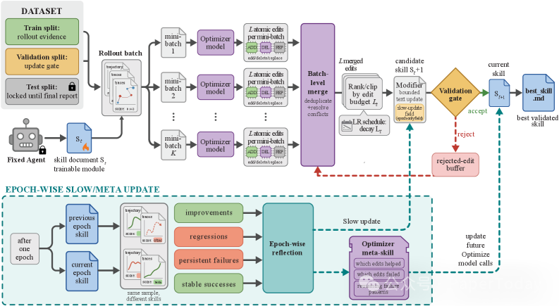

SkillOpt的pipeline

这个设计的关键不是某个单独组件，而是它们的组合。没有学习率控制，优化器会一次重写太多内容；没有验证门，看似合理的修改可能悄悄拉低表现；没有拒绝缓冲区，优化器会反复犯同样的错误。

## 52 个测试场景全胜，平均提升 23.5 分

数字是最直接的证据。**SkillOpt 在全部 52 个（模型 × 基准 × 执行模式）测试场景中，都是最佳或并列最佳的方法**，击败了人类手写 Skill、一次性 LLM 生成、Trace2Skill、TextGrad、GEPA、EvoSkill 六种基线。

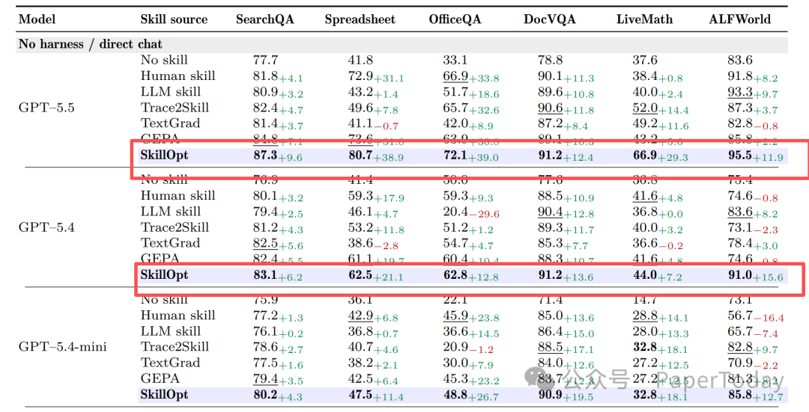

以 GPT-5.5 直接聊天模式为例：

|
基准

 |

无 Skill

 |

SkillOpt

 |

提升

 |
| --- | --- | --- | --- |
|

SpreadsheetBench

 |

41.8

 | **80.7** |

+38.9

 |
|

OfficeQA

 |

33.1

 | **72.1** |

+39.0

 |
|

LiveMath

 |

37.6

 | **66.9** |

+29.3

 |
|

ALFWorld

 |

83.6

 | **95.5** |

+11.9

 |
|

SearchQA

 |

77.7

 | **87.3** |

+9.6

 |
|

DocVQA

 |

78.8

 | **91.2** |

+12.4

 |

六项平均 **+23.5 分**。在 Codex 执行模式下平均 **+24.8 分**，在 Claude Code 模式下平均 **+19.1 分**。

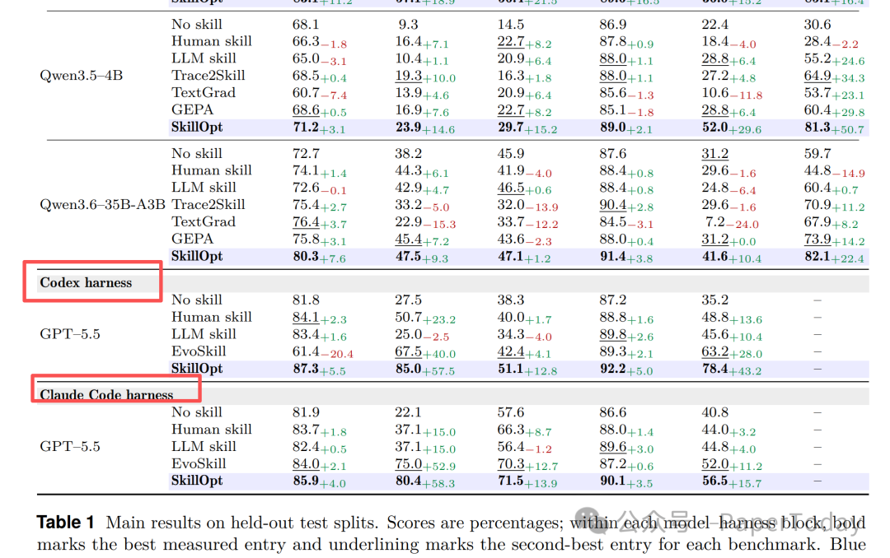

更值得注意的是，越弱的模型受益越大。GPT-5.4-nano 在 ALFWorld 上从 34.3 直接翻到 **69.4**（×2.0），在 DocVQA 上从 30.8 到 **80.2**（+49.4 分）。这意味着训练好的 Skill 可以给小模型补上它们权重里没有的程序性知识。

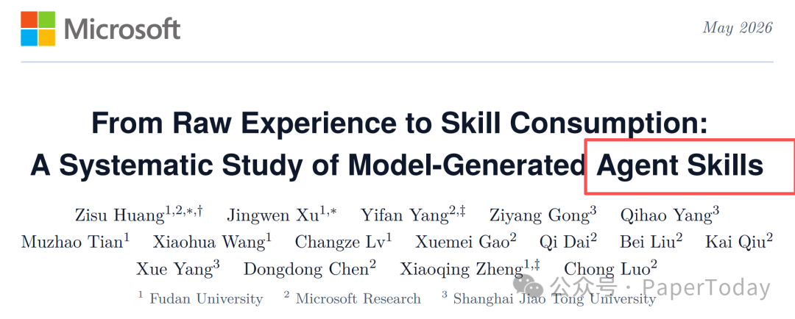

## 但 Skill 不是万能的——25% 会反噬

第二篇论文的发现更值得警惕。

研究团队在 5 个领域（机器人规划、表格操作、软件工程、网页搜索、工具调用）上，用 6 个目标模型和 5 个提取器，系统性地测了 Skill 生命周期的三个阶段：**经验生成 → Skill 提取 → Skill 消费**。

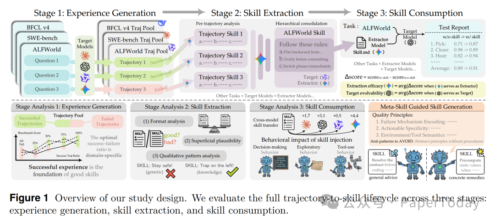

核心发现：**模型生成的 Skill 在 75% 的情况下有帮助，但有 25% 会造成负迁移——用了 Skill 反而变差。**

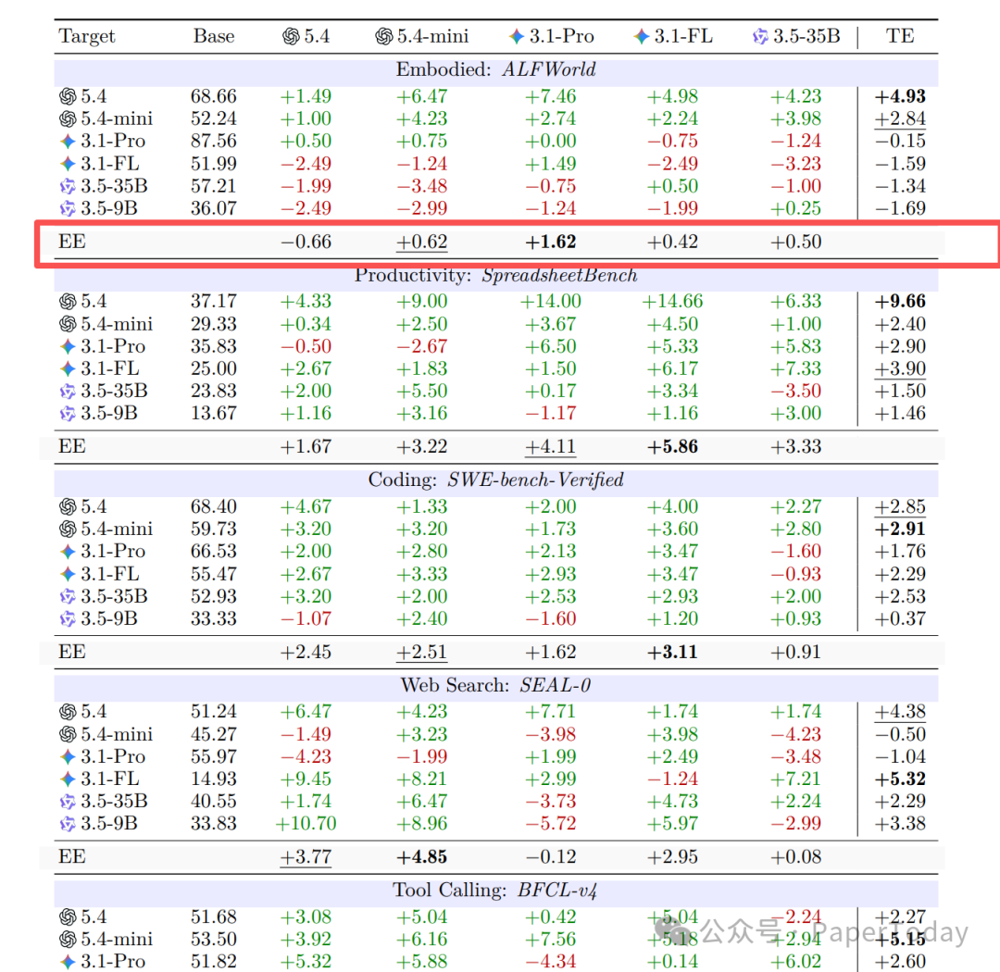

负迁移的风险因领域而异：表格操作和软件工程最低（仅 13%），但机器人规划（ALFWorld）高达 \*\*47%\*\*。

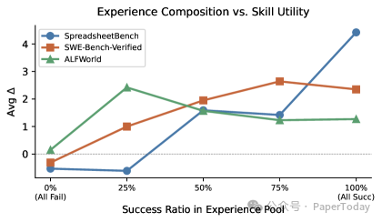

经验池组成对 Skill 质量的影响

还有两个反直觉的发现：

**更强的模型不一定是更好的 Skill 提取器。** 在 SpreadsheetBench 上，轻量级 Gemini-3.1-Flash-Lite 的提取效能最高，而 GPT-5.4 尽管任务执行能力最强，提取效能反而排在最后。提取 Skill 和执行任务是两种不同的能力。

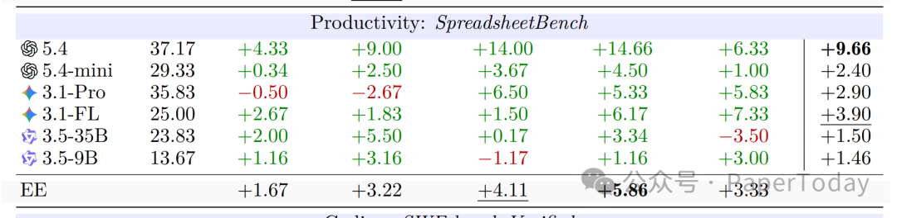

**看起来写得好的 Skill 反而效果最差。** 研究者让 GPT-5.4 当评委，只看 Skill 文本判断哪个更好。结果准确率 \*\*46.4%\*\*，跟抛硬币没区别。而且差距越大的 Skill 对（一个明显好一个明显差），评委判断准确率反而越低——差距 ≥5 分的极端情况下，准确率只有 \*\*15.8%\*\*。也就是说，读起来更流畅的 Skill，往往在实际使用中表现更差。

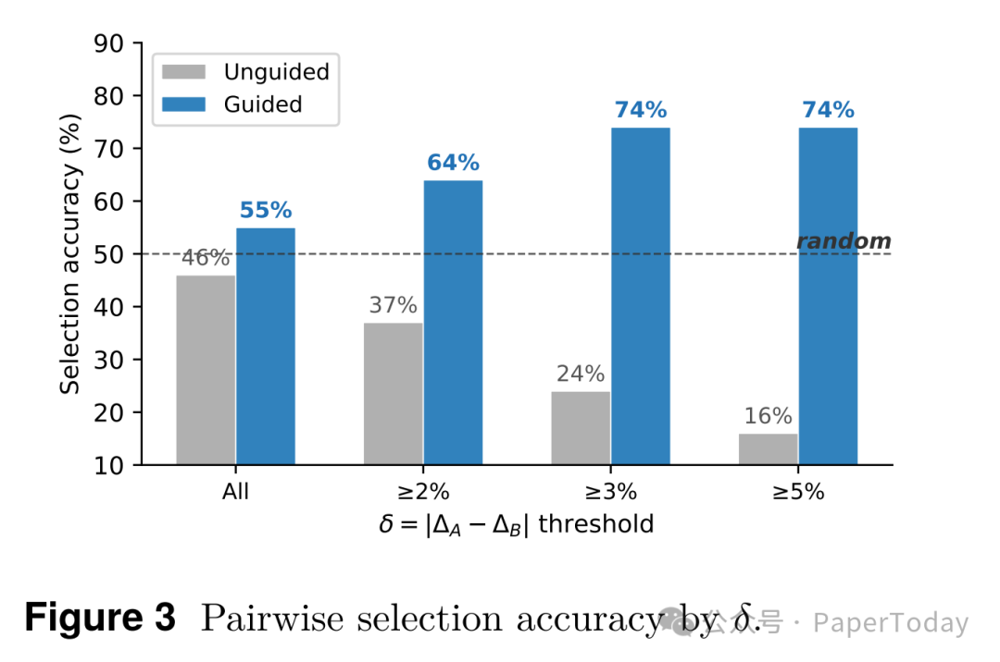

## 什么才是好 Skill？不是文笔，是故障机制

这个发现直接指向了一个实用结论：**判断 Skill 好坏的标准，不是文本质量，而是它有没有抓住具体的故障机制。**

研究团队通过自动化对比分析，发现了 3 个真正能预测 Skill 效用的维度：

1.  **故障机制编码**——有没有识别出领域特定的失败模式

2.  **可执行特异性**——有没有给出具体的、可操作的补救措施，而不是泛泛的建议

3.  **高风险操作黑名单**——有没有明确标注哪些操作绝对不能做

举个例子，SpreadsheetBench 上的高效果 Skill 写的是："公式注入谬误——在无头执行环境中，公式字符串不会触发计算引擎，所以必须在 Python 中预计算静态值再写入。" 低效果 Skill 写的是："编辑前先检查，编辑时保持最小改动。" 前者是具体的故障机制加可执行方案，后者是正确的废话。

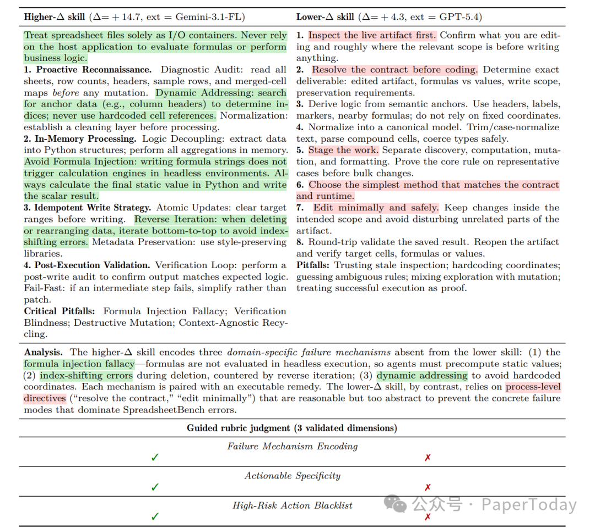

把这三个维度作为"Meta-Skill"插入提取器的系统提示后，**所有 9 个测试场景都改善了**（平均 +1.55 分），SpreadsheetBench 最大的提升达到 **+3.7 分**。而用 LLM 直觉列出的"合理性评分标准"（清晰性、完整性、简洁性等 7 个维度），反而让平均性能下降了 0.59 分。

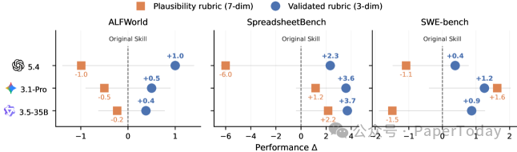

Meta-Skill 引导效果

## 这意味着什么

Skill 可以用类似训练模型的方式来优化——设定学习率、开验证门、用拒绝缓冲区、做 epoch 级的慢更新。生命周期研究告诉你：不是所有 Skill 都有用，判断标准不是文笔而是有没有抓住故障机制，而且有一个三维度的评分标准可以直接插到提取器里做质量把关。

而最终产出的，只是一个 **300-2000 token 的 Markdown 文件**。不需要改模型权重，不需要重新部署服务，只需要把这个文件塞进 Agent 的上下文。

对于在做 Agent 产品的人来说，这可能是目前性价比最高的领域适应方案。

[字节AutoSkill炸了，直接打通Skill任督五脉](https://mp.weixin.qq.com/s?__biz=Mzk0MTYzMzMxMA==&mid=2247507705&idx=1&sn=8da718cd59c9ea26025def321ed74ae8&scene=21#wechat_redirect)

[2篇SkillGraph，一篇阿里，一篇腾讯](https://mp.weixin.qq.com/s?__biz=Mzk2NDQ2ODY2Mg==&mid=2247485960&idx=1&sn=b243544173deeb2797bf86392b06a951&scene=21#wechat_redirect)

```
论文标题: SkillOpt: Executive Strategy for Self-Evolving Agent Skills论文链接: https://arxiv.org/html/2605.23904v2论文标题: From Raw Experience to Skill Consumption: A Systematic Study of Model-Generated Agent Skills论文链接: https://arxiv.org/html/2605.23899v1
```